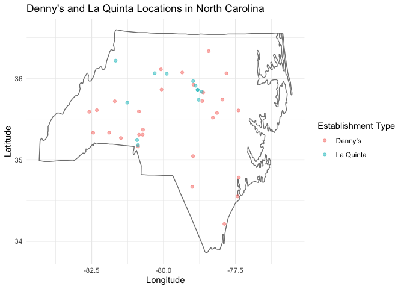
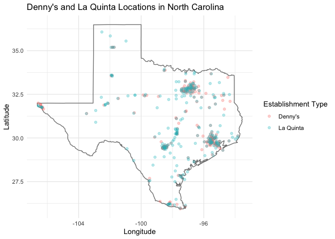

Lab 04 - Visualizing spatial data. La Quinta is Spanish for next to
Denny’s, Pt. 1
================
Yuxin Xie
2/7/25

### Load packages and data

``` r
#install.packages("devtools")
#devtools::install_github("rstudio-education/dsbox")
library(tidyverse) 
library(dsbox) 
```

``` r
D <- dsbox::dennys
LQ <- dsbox::laquinta
states <- read_csv("data/states.csv")
```

### Exercise 1

``` r
cat ("There are", nrow (D), "rows and", ncol(D), "variables in the Dennys dataset.", "\n") 
```

    ## There are 1643 rows and 6 variables in the Dennys dataset.

``` r
###There are six variables: address, city, state, zip code, longitude, and latitude. Each row represents one Denny's store. 
```

### Exercise 2

``` r
cat ("There are", nrow (LQ), "rows and", ncol(LQ), "variables in the Laquinta dataset.", "\n") 
```

    ## There are 909 rows and 6 variables in the Laquinta dataset.

``` r
###There are six variables: address, city, state, zip code, longitude, and latitude. Each row represents one La Quinta store. 
```

### Exercise 3

``` r
## from the website, La Quinta has some stores across the world, for instance, in South America: Chile, Colombia, Ecuador. In Asia: China. In Europe: Turkey. 
## All Danny's stores are in the US.
```

### Exercise 4

``` r
##Denny's 
non_us_states_D<-setdiff(states$abbreviation, D$state)
print(non_us_states_D)
```

    ## character(0)

``` r
##all Denny's stores are in the US

##La Quinta 
non_us_states_LQ<-setdiff(LQ$state, states$abbreviation)
print(non_us_states_LQ)
```

    ##  [1] "AG"  "QR"  "CH"  "NL"  "ANT" "ON"  "VE"  "PU"  "SL"  "FM"  "BC"

``` r
## There are stores in "AG"  "QR"  "CH"  "NL"  "ANT" "ON"  "VE"  "PU"  "SL"  "FM"  "BC" outside of the US. 
```

### Exercise 5

``` r
##Denny's locations outside the US
D %>%
  filter(!(state %in% states$abbreviation))
```

    ## # A tibble: 0 × 6
    ## # ℹ 6 variables: address <chr>, city <chr>, state <chr>, zip <chr>,
    ## #   longitude <dbl>, latitude <dbl>

``` r
##Note that the %in% operator matches the states listed in the state variable to those listed in states$abbreviation. The ! operator means not. 
```

### Exercise 6

``` r
D_US<-D %>%
  mutate(country = "United States")
## D_US<-will assign the result to D_US, if just run dn %>%
  #mutate(country = "United States"), It modifies the dataset temporarily but does not save the changes. 
```

### Exercise 7

``` r
LQ_NUS<-LQ %>%
  filter(!(state %in% states$abbreviation))
print (LQ_NUS$state)
```

    ##  [1] "AG"  "QR"  "CH"  "NL"  "ANT" "NL"  "NL"  "ON"  "VE"  "PU"  "PU"  "SL" 
    ## [13] "FM"  "BC"

``` r
print (LQ_NUS$address)
```

    ##  [1] "Carretera Panamericana Sur KM 12"                                       
    ##  [2] "Av. Tulum Mza. 14 S.M. 4 Lote 2"                                        
    ##  [3] "Ejercito Nacional 8211"                                                 
    ##  [4] "Blvd. Aeropuerto 4001"                                                  
    ##  [5] "Carrera 38 # 26-13 Avenida las Palmas con Loma de San Julian El Poblado"
    ##  [6] "AV. PINO SUAREZ No. 1001"                                               
    ##  [7] "Av. Fidel Velazquez #3000 Col. Central"                                 
    ##  [8] "63 King Street East"                                                    
    ##  [9] "Calle Las Torres-1 Colonia Reforma"                                     
    ## [10] "Blvd. Audi N. 3 Ciudad Modelo"                                          
    ## [11] "Ave. Zeta del Cochero No 407"                                           
    ## [12] "Av. Benito Juarez 1230 B (Carretera 57) Col. Valle Dorado Zona Hotelera"
    ## [13] "Blvd. Fuerza Armadas"                                                   
    ## [14] "8640 Alexandra Rd"

``` r
print (LQ_NUS$zip)
```

    ##  [1] "20345"  "77500"  "32528"  "66600"  "050016" "64000"  "64190"  "L1H1B4"
    ##  [9] "93210"  "75010"  "72810"  "78399"  "11101"  "V6X1C4"

``` r
## countries: Mexico, Colombia, Canada, and Honduras
## Mexico: AG, QR, CH, NL, VE, PU, SL, 
## Colombia: ANT
## Canada: ON, BC
## Honduras: FM
```

### Exercise 8

``` r
## countries: Mexico, Colombia, Canada, and Honduras
## Mexico: AG, QR, CH, NL, VE, PU, SL, 
## Colombia: ANT
## Canada: ON, BC
## Honduras: FM
LQ_country<-LQ %>%
  mutate(country = case_when(
    state %in% state.abb ~ "United States",
    state %in% c("ON", "BC") ~ "Canada",
    state == "ANT" ~ "Colombia",
    state == "FM" ~ "Honduras",
    state %in% c("AG", "QR", "CH", "NL", "VE", "PU", "SL") ~ "Mexico"
  ))
##Going forward we will work with the data from the United States only. 
##filter the La Quinta dataset for locations in United States.
LQ_US <- LQ_country %>%
  filter(country == "United States")
```

### Exercise 9 (1)

``` r
##Which states have the most and fewest Denny’s locations? What about La Quinta? 
# Descending order (highest to lowest)
D_US_desc <- D_US %>%
  group_by(state) %>%
  count(state) %>%
  arrange(desc(n))
# Ascending order (lowest to highest)
D_US_asc <- D_US %>%
  group_by(state) %>%
  count(state) %>%
  arrange(n)
# Print both
print("Descending Order:")
```

    ## [1] "Descending Order:"

``` r
print(D_US_desc)
```

    ## # A tibble: 51 × 2
    ## # Groups:   state [51]
    ##    state     n
    ##    <chr> <int>
    ##  1 CA      403
    ##  2 TX      200
    ##  3 FL      140
    ##  4 AZ       83
    ##  5 IL       56
    ##  6 NY       56
    ##  7 WA       49
    ##  8 OH       44
    ##  9 MO       42
    ## 10 PA       40
    ## # ℹ 41 more rows

``` r
print("Ascending Order:")
```

    ## [1] "Ascending Order:"

``` r
print(D_US_asc)
```

    ## # A tibble: 51 × 2
    ## # Groups:   state [51]
    ##    state     n
    ##    <chr> <int>
    ##  1 DE        1
    ##  2 DC        2
    ##  3 VT        2
    ##  4 AK        3
    ##  5 IA        3
    ##  6 NH        3
    ##  7 SD        3
    ##  8 WV        3
    ##  9 LA        4
    ## 10 MT        4
    ## # ℹ 41 more rows

``` r
## CA, California has the most Denny’s locations
## DE, Delaware has the fewest Denny’s locations

# Descending order (highest to lowest)
LQ_US_desc <- LQ_US %>%
  group_by(state) %>%
  count(state) %>%
  arrange(desc(n))
# Ascending order (lowest to highest)
LQ_US_asc <- LQ_US %>%
  group_by(state) %>%
  count(state) %>%
  arrange(n)
# Print both
print("Descending Order:")
```

    ## [1] "Descending Order:"

``` r
print(LQ_US_desc)
```

    ## # A tibble: 48 × 2
    ## # Groups:   state [48]
    ##    state     n
    ##    <chr> <int>
    ##  1 TX      237
    ##  2 FL       74
    ##  3 CA       56
    ##  4 GA       41
    ##  5 TN       30
    ##  6 OK       29
    ##  7 LA       28
    ##  8 CO       27
    ##  9 NM       19
    ## 10 NY       19
    ## # ℹ 38 more rows

``` r
print("Ascending Order:")
```

    ## [1] "Ascending Order:"

``` r
print(LQ_US_asc)
```

    ## # A tibble: 48 × 2
    ## # Groups:   state [48]
    ##    state     n
    ##    <chr> <int>
    ##  1 ME        1
    ##  2 AK        2
    ##  3 NH        2
    ##  4 RI        2
    ##  5 SD        2
    ##  6 VT        2
    ##  7 WV        3
    ##  8 WY        3
    ##  9 IA        4
    ## 10 MI        4
    ## # ℹ 38 more rows

``` r
## TX, Texas has the most La Quinta locations
## ME, Maine has the fewest La Quinta locations
```

### Exercise 9 (2)

``` r
## count how many observations are in each state
D_US_2<-D_US %>%
  count(state) %>%
  inner_join(states, by = c("state" = "abbreviation"))

LQ_US_2<-LQ_US %>%
  count(state) %>%
  inner_join(states, by = c("state" = "abbreviation"))
```

### Exercise 10

``` r
##Which states have the most Denny’s locations per thousand square miles? What about La Quinta?
D_US_2 %>%
  mutate (per = (n / area) * 1000) %>%
  arrange (desc(per))
```

    ## # A tibble: 51 × 5
    ##    state     n name                     area    per
    ##    <chr> <int> <chr>                   <dbl>  <dbl>
    ##  1 DC        2 District of Columbia     68.3 29.3  
    ##  2 RI        5 Rhode Island           1545.   3.24 
    ##  3 CA      403 California           163695.   2.46 
    ##  4 CT       12 Connecticut            5543.   2.16 
    ##  5 FL      140 Florida               65758.   2.13 
    ##  6 MD       26 Maryland              12406.   2.10 
    ##  7 NJ       10 New Jersey             8723.   1.15 
    ##  8 NY       56 New York              54555.   1.03 
    ##  9 IN       37 Indiana               36420.   1.02 
    ## 10 OH       44 Ohio                  44826.   0.982
    ## # ℹ 41 more rows

``` r
##DC has the most Denny’s locations per thousand square miles

LQ_US_2 %>%
  mutate (per = (n / area) * 1000) %>%
  arrange (desc(per))
```

    ## # A tibble: 48 × 5
    ##    state     n name             area   per
    ##    <chr> <int> <chr>           <dbl> <dbl>
    ##  1 RI        2 Rhode Island    1545. 1.29 
    ##  2 FL       74 Florida        65758. 1.13 
    ##  3 CT        6 Connecticut     5543. 1.08 
    ##  4 MD       13 Maryland       12406. 1.05 
    ##  5 TX      237 Texas         268596. 0.882
    ##  6 TN       30 Tennessee      42144. 0.712
    ##  7 GA       41 Georgia        59425. 0.690
    ##  8 NJ        5 New Jersey      8723. 0.573
    ##  9 MA        6 Massachusetts  10554. 0.568
    ## 10 LA       28 Louisiana      52378. 0.535
    ## # ℹ 38 more rows

``` r
## RI has the most La Quinta locations per thousand square miles

## put the two datasets together into a single data frame. 
## However before we do so, we need to add an identifier variable. 
D_US <- D_US %>%
  mutate(establishment = "Denny's")
LQ_US <- LQ_US %>%
  mutate(establishment = "La Quinta")

##Because the two data frames have the same columns, we can easily bind them with the bind_rows function
D_LQ <- bind_rows(D_US, LQ_US)

## plot the locations of the two establishments using a scatter plot
## color the points by the establishment type.
## latitude is plotted on the x-axis and the longitude on the y-axis.
ggplot(D_LQ, mapping = aes(
  x = longitude,
  y = latitude,
  color = establishment
)) +
  geom_point()
```

<!-- -->

### Exercise 11

``` r
##Filter the data for observations in North Carolina only, and recreate the plot
##You should also adjust the transparency of the points, by setting the alpha level, so that it’s easier to see the overplotted ones. 
D_LQ_NC <- D_LQ %>%
  filter(state == "NC")

ggplot(D_LQ_NC, mapping = aes(
  x = longitude,
  y = latitude,
  color = establishment
)) +
  borders("state", regions = "north carolina", colour = "gray50", fill = NA) +  # Adds NC border+
  geom_point(alpha = 0.5)+
  theme_minimal() +
  labs(title = "Denny's and La Quinta Locations in North Carolina",
       x = "Longitude",
       y = "Latitude",
       color = "Establishment Type")
```

<!-- -->

``` r
##Visually, does Mitch Hedberg’s joke appear to hold here?
## La Quinta next to Denny’s?
## The data does not support Mitch Hedberg’s joke. La Quinta and Denny’s locations do not consistently appear near each other.
```

### Exercise 12

``` r
##filter the data for observations in Texas only, and recreate the plot, with an appropriate alpha level. 
D_LQ_TX <- D_LQ %>%
  filter(state == "TX")

ggplot(D_LQ_TX, mapping = aes(
  x = longitude,
  y = latitude,
  color = establishment
)) +
  borders("state", regions = "Texas", colour = "gray50", fill = NA) +  # Adds TX border
  geom_point(alpha = 0.3)+
  theme_minimal() +
  labs(title = "Denny's and La Quinta Locations in North Carolina",
       x = "Longitude",
       y = "Latitude",
       color = "Establishment Type")
```

<!-- -->

``` r
##Visually, does Mitch Hedberg’s joke appear to hold here?
## La Quinta next to Denny’s?
## The data does not support Mitch Hedberg’s joke. La Quinta and Denny’s locations do not consistently appear near each other.
```
